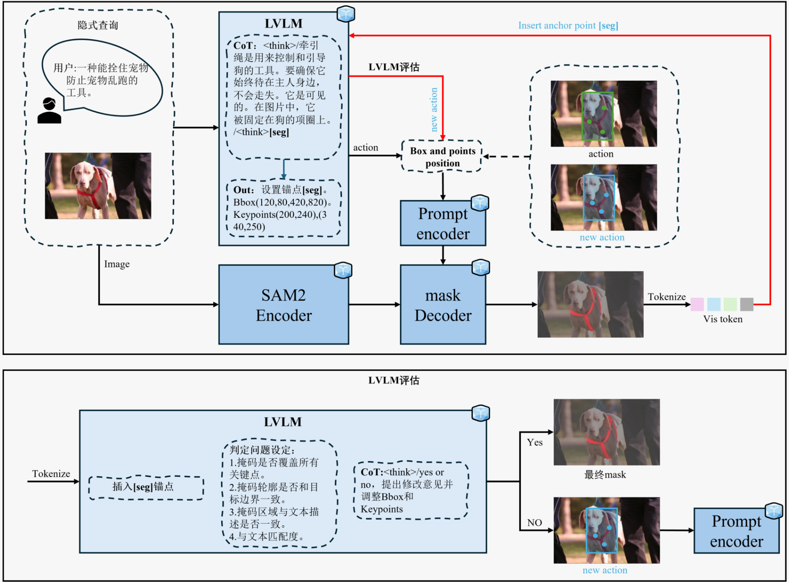

# SEGUE: Semantics-Guided Evolution for Open-Vocabulary Segmentation

<div align="center">

[](https://www.python.org/)
[](https://github.com/facebookresearch/sam2)
[](https://github.com/IDEA-Research/GroundingDINO)
[](https://huggingface.co/Qwen)
[]()

**SEmantics GUided Evolution: A Multi-Stage Open-Vocabulary Segmentation Framework**

</div>

<p align="center">
  
</p>

---

## 📋 简介

**SEGUE** 是一个多阶段开放词汇分割框架，通过语义引导的渐进式优化，将视觉语言模型的推理能力与基础模型的精确分割能力深度融合。

核心思路：
- 🎯 **Stage 1 (Grounding Pretrain)**: Grounding DINO + Prompt Refiner (LoRA) → 精修 bbox 与关键点 → SAM2
- 🧠 **Reasoning**: Qwen2.5-VL → 链式思考推理 → [SEG] 几何提示 → 迭代验证修正

## ✨ 核心模块

### Stage 1 — Grounding Pretrain

| 组件 | 说明 |
|------|------|
| **Grounding DINO** | Swin-T backbone (frozen) + LoRA on decoder → text-conditioned bbox |
| **Prompt Refiner** | RoI Align + MLP → refined bbox + keypoints (2 per object) |
| **SAM2** | Frozen, receives refined prompts → generates segmentation masks |
| **Loss** | L_geom (L1 + GIoU + Point L2) + L_align (Dice + BCE) |

**关键文件**: [`stage1_model.py`](stage1_model.py), [`stage1_train.py`](stage1_train.py), [`stage1_config.py`](stage1_config.py)

### Reasoning Stage — LVLM + SAM2

Qwen2.5-VL 观察图像 → 链式思考推理 → 输出 [SEG] 几何提示 → SAM2 生成候选 mask → 验证质量 → 不合格则迭代修正（最多 3 轮）

**关键文件**: [`segue_reasonseg.py`](segue_reasonseg.py)

### LVLM Pipeline — 双模式推理

| 模式 | 输入 | 说明 |
|------|------|------|
| **Reason** | 自然语言查询 | Qwen 理解语义 → JSON 提示 → SAM2 |
| **Detect** | 固定类别列表 | 替代 YOLO，LVLM 检测多类别目标 |

**关键文件**: [`lvlm_pipeline/lvlm_seg_fly.py`](lvlm_pipeline/lvlm_seg_fly.py)

### 自动 Prompt 学习

LVLM 从少量样本中自主学习类别视觉特征 → 自动生成检测 prompt → 写入配置

**关键文件**: [`lvlm_pipeline/learn.py`](lvlm_pipeline/learn.py)

### 消融实验

全监督分割基线 (DeepLabV3+/U-Net/FPN) vs LVLM+SAM2 zero-shot

**关键文件**: [`lvlm_pipeline/ablation_seg.py`](lvlm_pipeline/ablation_seg.py)

## 📁 项目结构

```
SEGUE/
├── README.md                         # 项目说明
├── requirements.txt                  # Python 依赖
│
├── stage1_config.py                  # Stage 1 配置文件
├── stage1_model.py                   # ★ Grounding DINO + Prompt Refiner + SAM2
├── stage1_train.py                   # ★ Stage 1 训练脚本
├── stage1_dataset.py                 # 数据集加载 (卫星3类)
├── stage1_losses.py                  # L_geom + L_align 损失函数
├── run_stage1.py                     # 一键训练入口
│
├── segue_reasonseg.py                # ★ Qwen + SAM2 推理分割
├── evaluate_miou.py                  # mIoU 评估
├── test_segue_full.py                # SEGUE 完整测试
├── test_segue_reasonseg.py           # 推理分割测试
├── test_segue_local.py               # 本地推理测试
├── test_inference.py                 # 推理测试
├── test_hybrid_verify.py             # 混合验证测试
├── test_vis_compare.py               # 可视化对比
│
└── lvlm_pipeline/                    # LVLM 辅助模块
    ├── lvlm_seg_fly.py               # 双模式推理 (Reason + Detect)
    ├── lvlm_sam2_pipeline.py         # LVLM+SAM2 完整管道
    ├── learn.py                      # 自动 Prompt 学习
    ├── ablation_seg.py               # 全监督消融基线
    └── eval.py                       # LVLM 评估
```

## 🚀 快速开始

```bash
pip install -r requirements.txt

# Stage 1 训练 (Grounding DINO + Prompt Refiner)
python run_stage1.py

# 推理分割 (Qwen + SAM2)
python segue_reasonseg.py

# 双模式推理 (LVLM Pipeline)
python lvlm_pipeline/lvlm_seg_fly.py --mode detect
python lvlm_pipeline/lvlm_seg_fly.py --mode reason --query "卫星的太阳能电池板"

# 自动学习类别特征
python lvlm_pipeline/learn.py

# 评估
python evaluate_miou.py
```

## 🛠️ 技术栈

| 层级 | 技术 |
|------|------|
| 语义 Grounding | Grounding DINO (Swin-T + BERT) |
| 几何分割 | SAM2.1 (Hiera-B+) |
| 推理引擎 | Qwen2.5-VL-3B-Instruct |
| 参数高效微调 | LoRA (r=16, α=32) |
| 损失函数 | L1 + GIoU + Point L2 + Dice + BCE |
| 消融基线 | DeepLabV3+, U-Net, FPN |

---

## 📄 License

本项目代码遵循 MIT 协议开源。

> 🚧 **Work in Progress** — 框架开发已完成，完整实验正在进行中，详细实验结果将在后续版本中陆续发布。相关论文拟投递期刊，届时将同步更新基准对比与消融分析。Stay tuned.
